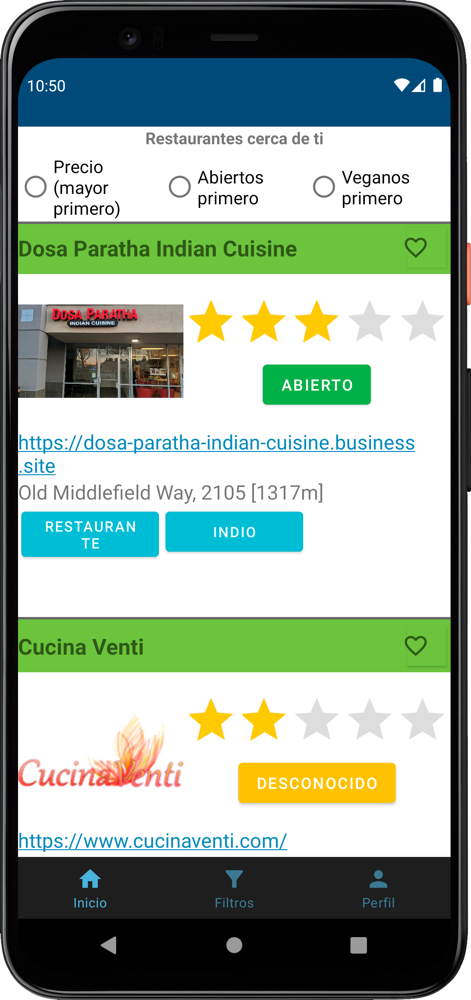
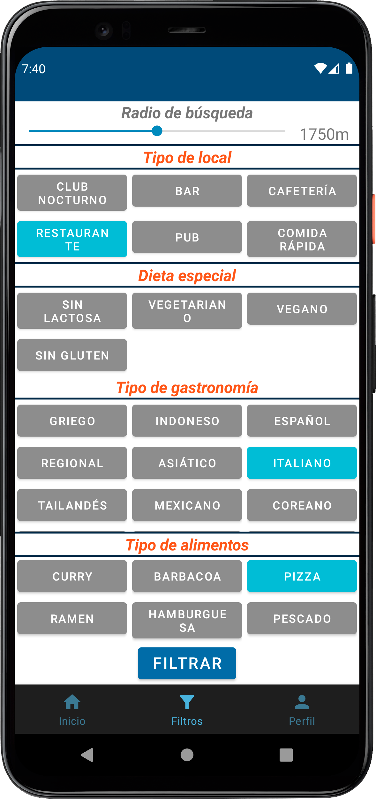
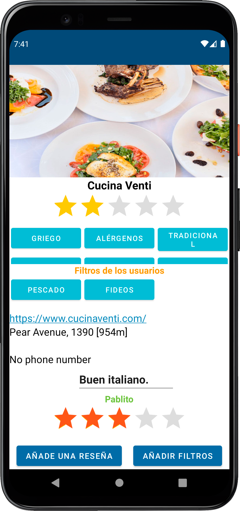
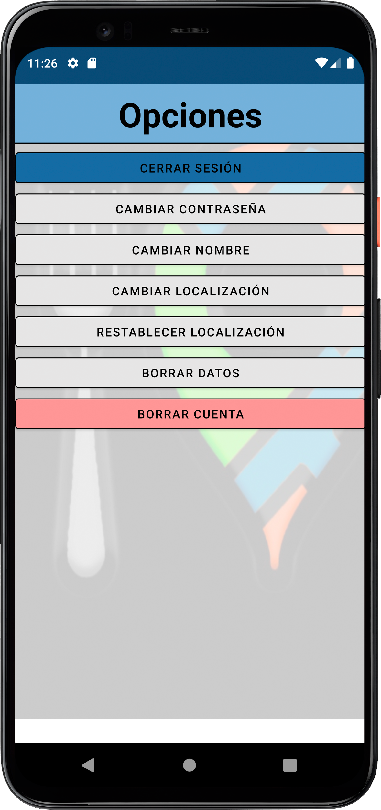

[Spanish Version](https://github.com/PabloSaenz99/PabloSaenz99/blob/main/README-ES.md)

# Hi, I'm Pablo!

## Software Engineer
***

📜 I'm Pablo Saenz and I'm graduated in Computer Engineering degree at the [Complutense University of Madrid](https://informatica.ucm.es/) and working as a Software Engineer at [Indra](https://www.indracompany.com/en). I have knowledge of Java, C++, Angular, Express, MongoDB, basic C programming and operating systems and cybersecurity, as well as programming on Android devices with Kotlin.

## Contact
You can contact me through:
<!--

-->
- LinkedIn: [Pablo Sáenz](https://www.linkedin.com/in/pablosaenzbullon).

# 🛠️ Skills

## Technologies

## Tools

## Learning

    
    

# 💻 Check my projects!

- ## [Final degree project](https://github.com/PabloSaenz99/appMenus)
    
    An Android app to search restaurants based on certain filters and preferences. It includes functions such as Web Scraping to obtain more information from their webs and a multitude of filters that can be combined with each other, to obtain more precise results.

    

    
Show images

    
    
    

    
    
    

- ## [Application to create hashes and encrypt text]()
    
    A simple Android application that allows you to create hashes and encrypt any type of text that is submitted.

- ## [MEAN Stack tutorial application](https://github.com/PabloSaenz99/PracticaAngular11)

    Web application based on an Angular frontend, Express and NodeJS backend and MongoDB database, managed by dockers, to create users and publish their tutorials.

- ## [Website for the purchase/sale of technological products](https://github.com/tolu9660/OfferNow/tree/practica4)

    Web application based on PHP and MySQL, with the ability to manage users, add and remove products and manage purchases and orders made.

- ## [Logic gate simulator]()

    Command console program, created in C++, that simulates the operation of logic gates. It allows to add doors in cascade, as well as to establish its entrance, to see what its exit would be.

- ## [Sudoku]()

    A Sudoku program, usable through the console and programmed in C++, that allows you to load new sudokus, play them and even suggest possible moves.

# 📊 Stats

